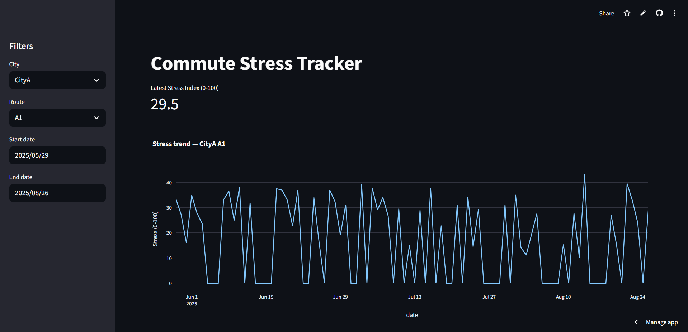

# 🚇 Commute Stress Tracker | Data Analytics & Visualization  

## 📖 Introduction  
Daily commutes can silently affect stress levels due to factors like travel time, mode of transport, and unpredictability.  
This project analyzes commuting patterns, estimates stress scores, and visualizes insights using Python and Streamlit.  
It demonstrates how **data cleaning, feature engineering, and interactive dashboards** can uncover hidden lifestyle stress factors.  

## 🔗 Live Link  
👉 [Click here to explore the deployed dashboard](https://silentcommutestresstracker.streamlit.app/)  

## 🖼️ Image Preview  
 

## ✨ Features  
- 📊 **Data Cleaning & Preprocessing** of raw commute logs  
- 🧮 **Stress Score Computation** based on commute duration, delays & conditions  
- 🧪 **Sample Data Generator** to simulate commute patterns  
- 📈 **Visual Analytics** with matplotlib, seaborn & plotly  
- 🌐 **Interactive Dashboard** built with Streamlit  
- 📓 **Exploratory Analysis Notebook** for deeper insights  

## 🛠️ Tech Stack  

| Category              | Tools / Libraries |
|-----------------------|-------------------|
| Data Handling         | pandas, numpy, python-dateutil |
| Visualization         | matplotlib, seaborn, plotly |
| Dashboard             | Streamlit |
| Notebook Environment  | Jupyter, notebook, ipython, ipykernel, nbformat |

## ⚙️ How It Works  
1. **Generate or Load Data** → Commute logs are loaded from CSV (`sample_commutes.csv`) or generated via `generate_samples.py`.  
2. **Clean & Transform** → Data is standardized (handling dates, missing values) using `loading_and_cleaning.py`.  
3. **Compute Stress** → Stress scores are calculated in `compute_stress.py` using commute duration, delays, etc.  
4. **Visualization** → Trends & comparisons plotted in `plots.ipynb`.  
5. **Interactive App** → `app.py` (Streamlit) ties everything together for real-time exploration.  

## 📂 Repository Structure  
```
├── 📁 data/ # Raw & processed commute datasets
│   ├── clean_commutes.csv
│   ├── sample_commutes.csv
│   └── with_stress.csv
│
├── 📁 src/ # Project source code
│   ├── app.py # Streamlit dashboard
│   ├── compute_stress.py # Stress calculation logic
│   ├── generate_samples.py # Sample data generator
│   ├── loading_and_cleaning.py # Data cleaning & prep
│   └── plots.ipynb # Data exploration & visualizations
│
├── requirements.txt # Python dependencies
└── README.md # Project documentation
```

## 🎯 Use Cases  
- 🚦 **Urban Planning** → Measure hidden commuter stress across different cities  
- 👩‍💻 **Workplace Wellness** → HR teams assessing employee commute burden  
- 📱 **Personal Insights** → Individuals analyzing daily commute impact on stress  
- 📊 **Data Science Showcase** → Demonstrates ETL, feature engineering, and visualization skills  

## ⚡ Setup Instructions  

1. **Clone the repository**  
   ```bash
   git clone https://github.com/Anushka-Sharma-008/silent-commute-stress-tracker.git
   cd silent-commute-stress-tracker
   ```
2. **Install dependencies**
   ```
   pip install -r requirements.txt
   ```
4. **Launch Streamlit Dashboard**
   ```
   streamlit run src/app.py
   ```

## 🙋‍♀️ Author

**Anushka Sharma**  
🌐 [LinkedIn](https://www.linkedin.com/in/anushkasharma008/) • 🐱 [GitHub](https://github.com/Anushka-Sharma-008) 
🎓 Learning Data Science, Analytics & Machine Learning

## ⭐ Show Your Support

If you found this project helpful or inspiring:

- ⭐ Star this repository  
- 🛠️ Fork it to build upon or adapt it for your own use  
- 💬 Share feedback or suggestions via Issues/Discussions
